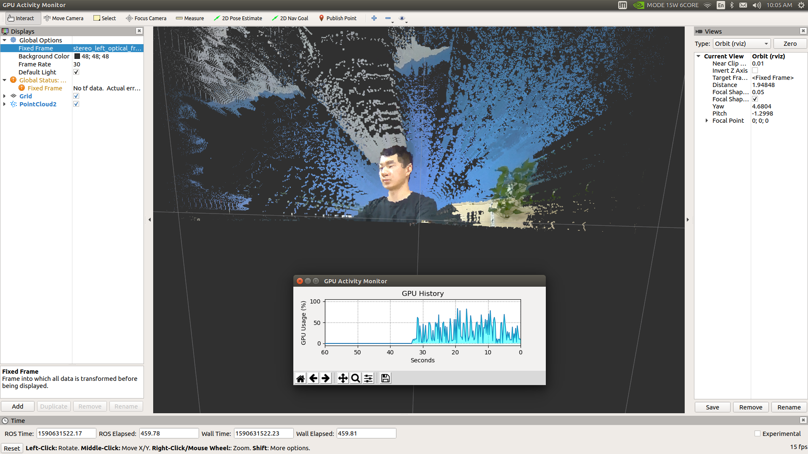
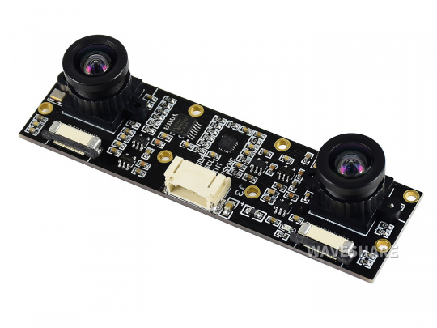

# jetson_stereo_csi_ros
ROS Package for Jetson CSI Stereo Camera and GPU Accelerated Depth Processing

Tested on JetPack 4.4 (OpenCV 4.1, VisionWorks 1.6)
<p align="center">
  
</p>
## Tested Stereo Module
<p align="center">
  
</p>
Waveshare [IMX219-83 Stereo Camera](http://www.waveshare.net/wiki/IMX219-83_Stereo_Camera)
## Installation
### Step 1 ROS Installation
1. Do steps 1.2 and 1.3 from http://wiki.ros.org/melodic/Installation/Ubuntu
2. Install non-opencv dependent ros packages:
```bash
$ sudo apt-get install ros-melodic-ros-base ros-melodic-image-transport ros-melodic-tf ros-melodic-tf-conversions ros-melodic-eigen-conversions ros-melodic-laser-geometry ros-melodic-pcl-conversions ros-melodic-pcl-ros ros-melodic-move-base-msgs ros-melodic-rviz ros-melodic-octomap-ros ros-melodic-move-base ros-melodic-slam-toolbox ros-melodic-rqt ros-melodic-rqt-reconfigure libgtk2.0-dev libhdf5-openmpi-dev libsuitesparse-dev
```
3. Do step 1.5 and 1.6 from http://wiki.ros.org/melodic/Installation/Ubuntu
### Step 2 Build OpenCV Dependent Packages from Source
```bash
$ cd ~/catkin_ws/src
$ git clone -b opencv4 https://github.com/fizyr-forks/vision_opencv.git
$ git clone -b melodic https://github.com/ros-perception/image_pipeline.git
$ git clone -b indigo-devel https://github.com/ros-perception/image_transport_plugins.git
$ git clone https://github.com/ros-drivers/gscam.git
$ git clone https://github.com/ros-visualization/rqt_image_view.git
$ catkin_make
```
